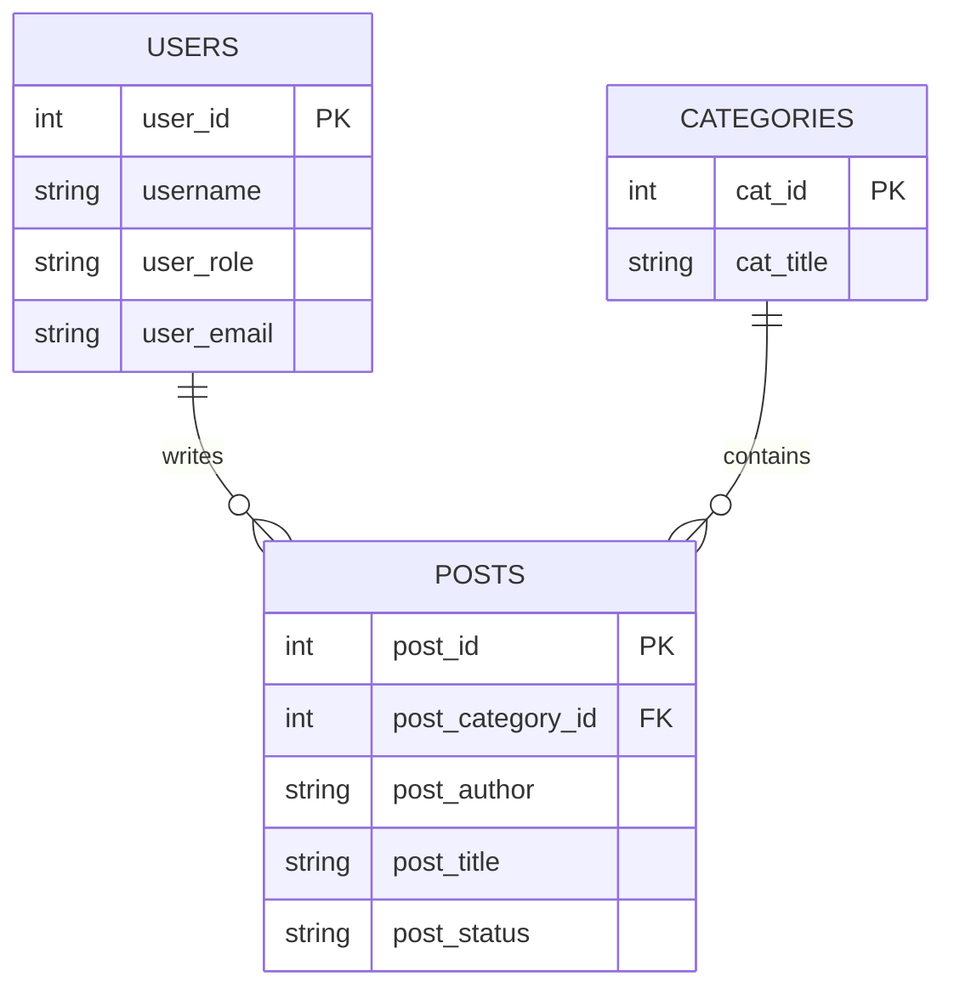

# BlogSphere Database Documentation

## Overview

The BlogSphere application uses a relational database to manage blog content, user authentication, and categorization. The database consists of three primary tables: `users`, `categories`, and `posts`.

## Tables

### 1. `users` Table

Stores information about registered users, including administrators and other roles.

- **Primary Key**: `user_id` (INT, Auto Increment)
- **Columns**:
  - `username` (VARCHAR): Unique identifier for login.
  - `user_password` (VARCHAR): Hashed password (typically using Bcrypt).
  - `user_firstname` (VARCHAR): User's first name.
  - `user_lastname` (VARCHAR): User's last name.
  - `user_email` (VARCHAR): User's email address.
  - `user_image` (TEXT): Path to the user's profile image.
  - `user_role` (VARCHAR): Defines permissions (e.g., 'admin', 'subscriber').
  - `randSalt` (VARCHAR): Salt for password hashing (legacy support).

### 2. `categories` Table

Manages the various topics or sections under which blog posts are organized.

- **Primary Key**: `cat_id` (INT, Auto Increment)
- **Columns**:
  - `cat_title` (VARCHAR): The name of the category (e.g., "Technology", "Travel").

### 3. `posts` Table

The central table storing the blog posts.

- **Primary Key**: `post_id` (INT, Auto Increment)
- **Columns**:
  - `post_category_id` (INT): Foreign key linking to `categories.cat_id`.
  - `post_title` (VARCHAR): The title of the blog post.
  - `post_author` (VARCHAR): The username of the author (links to `users.username`).
  - `post_user` (VARCHAR): Alternative user field (nullable).
  - `post_date` (DATE): The publication date.
  - `post_image` (TEXT): Filename of the featured image.
  - `post_content` (TEXT): The main body of the post.
  - `post_tags` (VARCHAR): Comma-separated tags for search and filtering.
  - `post_comment_count` (INT): Number of comments on the post.
  - `post_status` (VARCHAR): Publication status (e.g., 'draft', 'published').
  - `post_views_count` (INT): Tracks how many times the post has been viewed.

## Relationships

### Posts to Categories (One-to-Many)

- **Link**: `posts.post_category_id` → `categories.cat_id`
- **Description**: Each post is assigned to a single category. A category can contain multiple posts. This relationship enables filtering content by topic.

### Posts to Users (One-to-Many)

- **Link**: `posts.post_author` → `users.username`
- **Description**: Each post is authored by a specific user. A single user can write multiple posts.
- **Implementation Note**: The application currently links posts to users via the `username` string rather than the `user_id`.

## Entity Relationship Diagram

